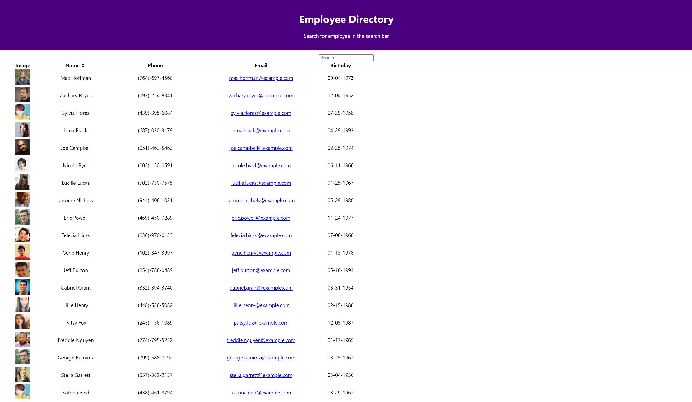

# Employee-Directory

## Table of Contents
  - [Employee Directory](#employee-directory)
  - [Table of Contents](#table-of-contents)
  - [Description](#description)
  - [Installation](#local-installation)
  - [Business Context](#business-context)
  - [Demo](#demo)
  - [Contributors](#contributors)

## Description

For this assignment, I created an employee directory with React. I broke up the application's UI into components, managed component state, and responded to user events.

## Business Context

An employee or manager would benefit greatly from being able to view non-sensitive data about other employees. It would be particularly helpful to be able to filter employees by name.

## Tech/Modules Used :

### [Javascript](https://developer.mozilla.org/en-US/docs/Web/JavaScript) : 
* JavaScript is a cross-platform, object-oriented scripting language used to make webpages interactive.
* JavaScript(JS) is a lightweight, interpreted, or just-in-time compiled programming language with first-class functions. 
* With the HTML DOM, JavaScript can access and change all the elements of an HTML document.

### [React Bootstrap](https://react-bootstrap.github.io/) : 
* React-Bootstrap replaces the Bootstrap JavaScript. Each component has been built from scratch as a true React component, without unneeded dependencies like jQuery.

## Local Installation 

* Clone this repository to your local workstation.
* Run 'npm install' to install dependencies required for this project.
* Run 'npm start' to deploy app

## Screenshot  
| |

## Contributor
* Brandon Johnson
<<<<<<< HEAD
* Repository: https://github.com/sheikb08/Employee-Directory
=======
* Repository: https://github.com/sheikb08/Fitness-Tracker
>>>>>>> 7d8e121fb5a71899b20329639a58fcce5b79c983
